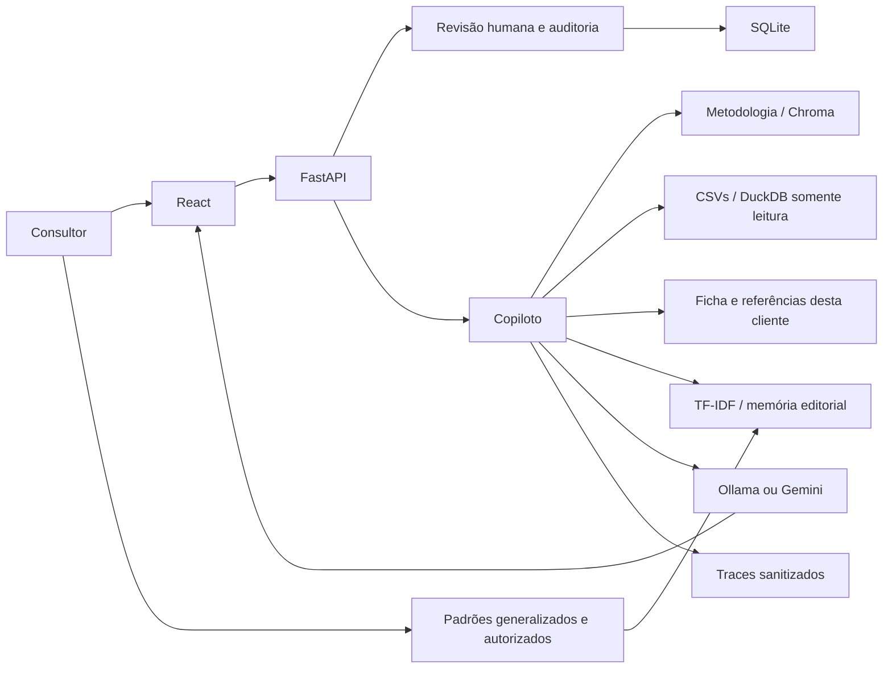

# Copiloto de Consultoria de Imagem — React / Lovable

O consultor conduz o atendimento, registra sua avaliação e aprova o dossiê. O copiloto auxilia na recuperação de metodologia, consulta de dados e redação de rascunhos. As peças e referências são introduzidas pelo consultor e exclusivas do atendimento. Não há classificação automática de peças ou catálogo fixo.

## Comece aqui

**Novo: [cadastro, login e contas SaaS](docs/SAAS.md).** Cada consultor cria sua conta e começa com um estúdio vazio. Exemplos fictícios são opcionais. Nome profissional, atendimentos, biblioteca ML e traces pertencem à conta. A assinatura mensal está preparada como piloto sem cobrança; pagamento e nuvem ainda não foram integrados. Dados anteriores ficam preservados e precisam de atribuição administrativa explícita.

1. [Arquitetura e mecanismos](docs/ARQUITETURA.md): responsabilidades, fluxos e autoridade.
2. [Correspondência com a disciplina](docs/DISCIPLINA.md): o que está implementado e o que falta nas etapas 2/3.
3. [Migração](docs/MIGRACAO.md): origem dos recursos e limites da conversão.
4. [API](docs/API.md): contratos e revisões.
5. [Segurança](docs/SEGURANCA.md): proteções do piloto e requisitos de produção.
6. [Roadmap](docs/ROADMAP.md): evolução acadêmica e futura aplicação real.
7. [ML editorial](docs/ML_EDITORIAL.md): curadoria, treinamento e avaliação da compilação.
8. [Validação](docs/VALIDACAO.md): testes, evidências e limites reais.

## Stack

- React 19, TypeScript, TanStack Start, Tailwind e componentes da estrutura Lovable.
- FastAPI/Pydantic para serviços e contratos.
- SQLite para atendimentos locais; DuckDB para consultas reproduzíveis aos CSVs fictícios.
- ChromaDB com embeddings Ollama para resumos próprios; indexador original preservado.
- Ollama local ou Gemini opcional. Segredos ficam no backend.
- scikit-learn para recuperação ML dos padrões editoriais autorizados.
- pytest para invariantes; golden dataset de 18 perguntas e avaliação de recuperação.



## Executar sem copiar e colar código

Pré-requisitos: Python 3.12, Node 22+ e pnpm 11.25.0. Ollama precisa estar disponível para IA e embeddings. Os modelos `llama3.1:8b` e `nomic-embed-text` já foram identificados neste computador.

Na primeira execução, a partir desta pasta:

```powershell
.\scripts\start.ps1 -Install -Index
```

O script cria o ambiente, instala dependências, cria `.env` a partir do exemplo, indexa os resumos e inicia os serviços locais. Pode receber `-PythonPath` e `-PackageManagerPath` quando as ferramentas não estiverem no PATH. Revise `.env` se usar outro provedor.

Nas próximas execuções:

```powershell
.\scripts\start.ps1
```

Interface: http://127.0.0.1:3000. Contratos da API: http://127.0.0.1:8000/docs. O script inicia a interface em processo oculto e informa seu PID; a API fica no terminal. Não use este procedimento para expor dados reais em rede.

Execução manual de manutenção, se necessária:

```powershell
.\.venv\Scripts\python.exe -m backend.vector
.\.venv\Scripts\python.exe -m uvicorn backend.app:app --host 127.0.0.1 --port 8000
pnpm run dev --host 127.0.0.1 --port 3000
```

## Validação

```powershell
.\scripts\validate.ps1
```

A suíte cria bancos temporários: não testa no banco do consultor. A avaliação de recuperação grava evidências em `runtime/`. Testes com provedor simulado validam o fluxo, não a qualidade da IA. As métricas acadêmicas de faithfulness/answer relevancy e o corpus/avaliação profissional do ML ainda precisam ser concluídos.

## Uso

- Cadastre apenas `Cliente A`, `Cliente I` etc. neste piloto.
- Registre questionário e avaliação separadamente.
- Cadastre referências apenas no atendimento selecionado, com orientação profissional.
- Redija ou solicite rascunho, revise, salve e aprove cada página.
- Alterar conteúdo/ficha/referências exige nova revisão.
- Na Biblioteca editorial, autorize padrões gerais a partir de páginas aprovadas e atualize o modelo para usá-los no copiloto.
- Exporte textos aprovados ou uma pasta ZIP para continuar o atendimento.

Sem API, a tela de acesso continua disponível, mas cadastro e login exigem o serviço conectado. A aplicação não autentica contas ficticiamente nem salva alterações somente em memória.

## Limitações e implantação

Com login e isolamento por consultor; pagamento e publicação completa ainda pendentes. O histórico consultável contém os oito exemplos CSV; os novos atendimentos ficam no SQLite local. Pré-análise facial é opcional e experimental, com instalação separada e modelo local. Não houve migração do banco privado do aplicativo anterior.

A interface segue o repositório conectado ao Lovable. Uma publicação completa precisa hospedar a API Python, proteger o acesso e configurar `VITE_API_URL` com uma URL HTTPS. Uma prévia visual ou um push Git não representam a entrega final da disciplina.

`academic/` preserva a etapa 1. `previous/`, quando presente nesta cópia local, é referência selecionada e ignorada no Git. Os originais permanecem intactos.

O desafio e a justificativa da primeira entrega foram preservados em [CBL original](docs/CBL_ORIGINAL.md).
