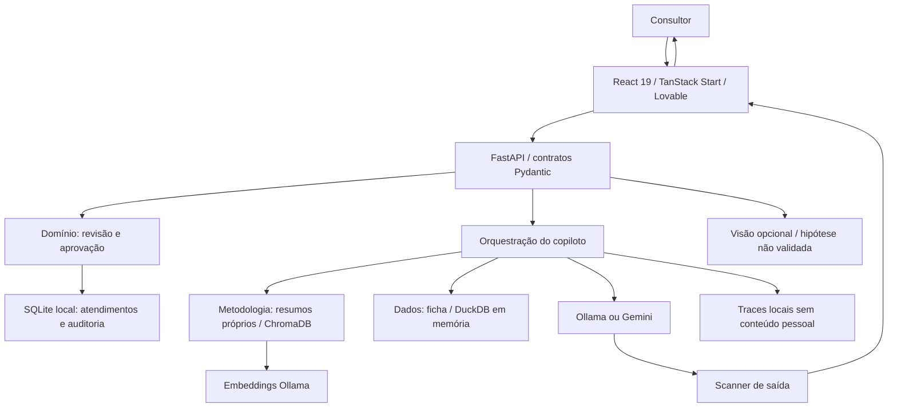

# Arquitetura e mecanismos

## Objetivo

Reduzir o trabalho de organizar fichas e redigir dossiês de consultoria de imagem. A avaliação, revisão e decisão final pertencem ao consultor. A IA não recebe ferramenta para aprovar, publicar, alterar uma avaliação profissional ou fazer diagnóstico.

## Responsabilidades por diretório

| Pasta | Responsabilidade | Pode aprovar? |
| --- | --- | --- |
| `src/features/consultoria` | Interface, navegação, editor, fichas e contrato HTTP | Solicita decisão explícita do consultor |
| `backend/models.py` | Validação de entradas e controle de campos | Não |
| `backend/store.py` | Transações, revisões e eventos de auditoria | Apenas por chamada de decisão humana |
| `backend/intelligence.py` | Recuperação, geração, SQL e orquestração | Não |
| `backend/vector.py` | Indexação Chroma com embeddings Ollama | Não |
| `backend/vision.py` | Código experimental de pré-análise do projeto anterior | Não |
| `academic/` | Snapshot da etapa 1, CSVs, catálogo de pacotes e resumos | Interface anterior preservada |
| `evaluation/` | Golden dataset e avaliação da recuperação | Não |
| `tests/` | Invariantes, fronteiras e testes de integração | Não |
| `runtime/` | Dados e índices locais; ignorado pelo Git | Não versionado |

## Fluxo de um atendimento

1. O consultor cria ou seleciona um identificador fictício e um pacote.
2. Registra questionário e avaliação, mantendo suas origens separadas.
3. Redige uma página ou solicita um rascunho ao copiloto.
4. O copiloto cruza ficha, histórico recente e trechos da metodologia; registra fontes e um trace.
5. O consultor salva, revisa e aprova explicitamente a página.
6. Alterar texto, ficha ou referências visuais invalida a aprovação correspondente. Alterar a ficha invalida todas as páginas.
7. A exportação final inclui apenas os textos aprovados. A pasta ZIP preserva o atendimento para continuidade.

O campo `revision` implementa concorrência otimista. Toda escrita transacional compara a revisão recebida com a atual. A API devolve HTTP 409 quando há uma versão mais recente. Isso evita que uma aba sobrescreva silenciosamente o trabalho de outra.

## Dados e busca

Os oito CSVs continuam sendo a fonte reproduzível dos exemplos acadêmicos. Para consultas de histórico, o backend os carrega em um DuckDB isolado em memória. Esse histórico é o conjunto da etapa 1; ainda não inclui atendimentos novos ou modificações das fichas React.

SQLite armazena os atendimentos editáveis, chat por atendimento e auditoria. A separação é intencional: o conjunto acadêmico não muda conforme o usuário experimenta a interface.

Chroma pode operar com o `nomic-embed-text` já instalado no Ollama (`RAG_MODE=chroma-ollama`). O índice tem uma coleção própria: não reaproveita vetores incompatíveis do projeto anterior. O modo `chroma` preserva o indexador sentence-transformers do handoff. O modo `lexical` é um fallback explícito de desenvolvimento, não uma validação de busca semântica.

Nenhum PDF de terceiros ou imagem de cliente é indexado. Os oito resumos próprios em `academic/knowledge/` são as fontes do RAG metodológico. A memória editorial autorizada é uma camada separada de recuperação ML (ver ML_EDITORIAL.md).

## Agentes e autoridade

A migração implementa uma orquestração determinística de dois papéis: metodologia (recuperar trechos) e atendimento/dados (consultar ficha e casos). Eles participam do mesmo chat e compartilham contexto. A escolha de consulta estruturada ainda usa padrões de intenção; não é um sistema CrewAI autônomo. A matriz da disciplina registra essa lacuna para a etapa 2.

A pré-análise facial permanece experimental e separada em `hipotese_visagismo`. Não preenche `avaliacao.visagismo` automaticamente. Também não representa o modelo de ML treinado exigido na etapa 2: trata-se de um componente reaproveitado e heurístico.

## Streaming e observabilidade

O endpoint `/chat` transmite eventos NDJSON `status`, `delta`, `final` ou `erro`. Os deltas vêm do streaming real do provedor, com buffer por frase para o scanner de saída. Não há animação artificial de uma resposta já pronta. O histórico só é gravado ao concluir a resposta.

Traces registram tempo total, etapas, agentes, tokens fornecidos pelo provedor e tipo do erro. Perguntas, respostas, fichas e imagens não entram no log. Custo desconhecido fica nulo, nunca zero inventado. O painel é local e não é apresentado como Langfuse.

## Limites antes de produção

Este piloto tem um consultor local e clientes fictícios, sem autenticação multiusuário. Não deve receber dados reais ou ser publicado como serviço aberto antes de implementar identidade, autorização, isolamento, backup, consentimento e retenção. A interface Lovable e a API Python têm ciclos de implantação distintos.

## Referências exclusivas por atendimento

`POST /sessions/{sid}/references` registra título, tipo preenchido pelo consultor, ocasião, cor/modelagem, orientação e link. `GET /sessions/{sid}/references?q=` busca apenas nessa sessão. As referências começam vazias; não há catálogo fixo de peças, classificação automática ou transferência de escolhas entre clientes. O copiloto recebe somente as referências do atendimento ativo que correspondam ao pedido. São preservadas na pasta ZIP. O histórico CSV acadêmico serve a demonstrações, não alimenta recomendações personalizadas.

## Memória editorial e compilação ML

`backend/library.py` recebe somente padrões generalizados explicitamente autorizados pelo consultor a partir de páginas aprovadas. Armazena origem, hash e auditoria em tabelas SQLite separadas dos atendimentos. A ação de treinamento ajusta TF-IDF no corpus autorizado e registra versão, tamanho e vocabulário. Busca por similaridade cosseno complementa o RAG; resultados são referências de escrita, nunca evidências sobre a cliente atual. O copiloto não possui ferramentas de autorizar ou treinar. Atualizações/retiradas do corpus pausam a recuperação até novo treino. Ver ML_EDITORIAL.md para limites e avaliação.

A interface protege alterações não salvas ao mudar de área/atendimento. Erros de gravação não limpam o texto digitado nem exibem sucesso. O aviso de saída do navegador depende do comportamento do próprio navegador.
