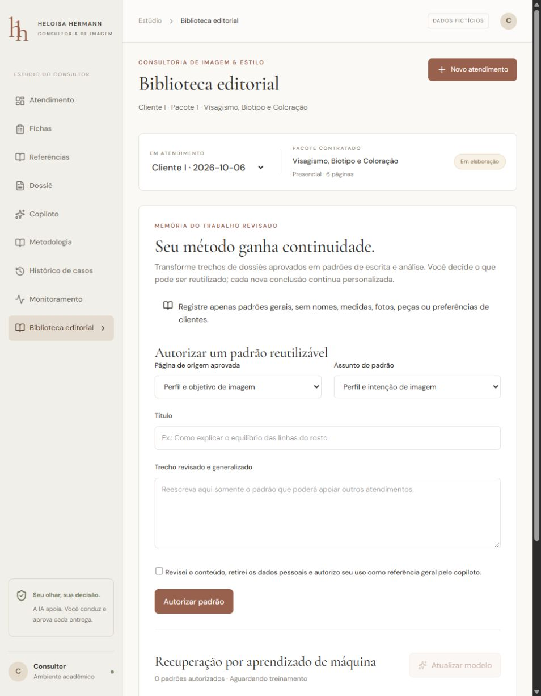

# Validação da migração React

Execução local em 05/10/2026 (horário de Brasília; registros técnicos usam UTC), Python 3.12 e runtime Node disponibilizado no computador. Todas as entradas criadas na verificação são fictícias. Os arquivos/bancos originais não foram alterados.

## Evidências obtidas

| Verificação | Resultado | O que comprova |
| --- | --- | --- |
| TypeScript `tsc --noEmit` | Passou | Contratos e componentes compilam |
| ESLint | Zero erros; seis avisos de Fast Refresh nos componentes da estrutura original | Regras e formatação verificadas; avisos não bloqueiam build |
| Vite client + SSR + worker Cloudflare | Passou | Artefato React construído; não comprova implantação pública |
| `pytest tests -q` | **37 passaram** | Aprovação humana, revisão concorrente, isolamento, ZIP/imagens, SQL restrito, streaming e biblioteca editorial/ML |
| `python -m evaluation.retrieval` | **14/14** em modo lexical e depois Chroma/Ollama | Onze verificações de presença da fonte esperada entre quatro resultados e três bloqueios de entrada |
| Índice Chroma/Ollama | **66 trechos** indexados | Embeddings dos resumos próprios gerados no computador |
| Ollama `llama3.1:8b` | **Cinco execuções reais**: um rascunho e quatro consultas com streaming | Integração real, fontes, latência e tokens do provedor; não são métricas de qualidade da geração |
| Interface desktop e 390×844 | Conferida no navegador | Navegação, campos, restrições e layout responsivo |

Os testes Python emitiram um aviso de depreciação da integração Starlette/AnyIO. O build emite avisos da estrutura Vite/Nitro sobre configuração de caminhos e inlineDynamicImports; conclui com sucesso. Não se modificou o scaffold para corrigir avisos sem efeito nesta migração.

## Fluxo observado na interface

Foi criado `Cliente I` como atendimento exclusivamente fictício de demonstração. A ficha foi salva, a tentativa de navegação com alterações não salvas foi bloqueada, e o rascunho real da IA apareceu em revisão com quatro fontes. O texto foi substituído manualmente por um exemplo de demonstração, salvo e aprovado. A biblioteca passou a disponibilizar essa página como origem possível, exigindo uma autorização separada para reutilização. A biblioteca de uso do aplicativo foi mantida vazia.

Os testes de ML ajustam TF-IDF em dois padrões fictícios temporários, verificam ranking, exclusão da proveniência pessoal do prompt e interrupção após retirada. Esses exemplos não são dataset profissional nem avaliação de generalização.

[Evidência do layout móvel](screenshots/biblioteca-mobile.png).

## Traces reais

Além do rascunho, foram executadas quatro perguntas sobre contraste/cartela, registro de visagismo, objetivo/rotina e revisão do dossiê. Cada uma retornou quatro fontes e deltas reais do provedor. Latências observadas: **13,38 s; 9,64 s; 7,26 s; 7,10 s**. Tokens entrada/saída: **1191/87; 1184/159; 1658/113; 2002/109**. Custo monetário não conhecido fica `null`.

Evidências completas locais: `runtime/traces.jsonl`, `runtime/smoke-llm.json` e `runtime/evaluation-retrieval.json`. São arquivos gerados, ignorados no Git; não incluir prontuários ou chaves em relatórios. O painel Monitoramento permite conferir os traces do ambiente conectado. Repetir as mesmas perguntas pode ter latência/tokens diferentes.

## Reprodução

Instalar o ambiente com `scripts/start.ps1 -Install -Index`; o script usa `requirements-lock.txt` (backend, ML e vetor validados no Windows) e `pnpm-lock.yaml`. Em seguida executar `scripts/validate.ps1`. Para reproduzir a recuperação vetorial, definir `RAG_MODE=chroma-ollama`, manter Ollama disponível e o índice criado. Os módulos de inteligência e indexação leem o `.env`; variáveis já definidas no shell têm precedência.

Para regenerar a prévia fictícia: `python scripts/generate-fixtures.py` e `pnpm exec prettier --write src/features/consultoria/fixtures.ts`. Não editar os exemplos em dois lugares.

## Limites e verificações pendentes

- Corpus editorial autorizado e avaliação ML com consultas independentes: pendentes. O script de avaliação existe, mas nenhum resultado profissional foi declarado.
- Faithfulness/answer relevancy com DeepEval ou equivalente: pendentes. Recall de fonte e testes com LLM simulada não as substituem.
- Agentes autônomos, equivalência da observabilidade e adequação de React/recuperação ML à rubrica: revisar conforme DISCIPLINA.md.
- Pré-análise facial e provedor Gemini opcionais: dependências separadas, sem validação completa nesta execução. O componente facial tem endpoint, sem nova interface React dedicada.
- Login, multiusuário, dados reais e implantação pública completa: pendentes. O piloto opera localmente e a interface sem API entra em prévia explícita.
- Scripts PowerShell de instalação: revisados; não foram executados criando uma nova `.venv`, pois a validação usou dependências isoladas. A instalação de ponta a ponta num computador limpo ainda deve ser conferida.

A descoberta de uma importação antiga durante a checagem visual foi corrigida separando a função comum em `format.ts`; TypeScript, lint e build foram repetidos. Não confundir essa migração e suas evidências locais com a conclusão das etapas 2/3.
